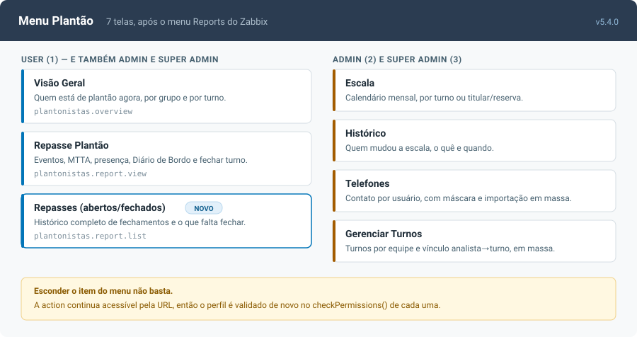
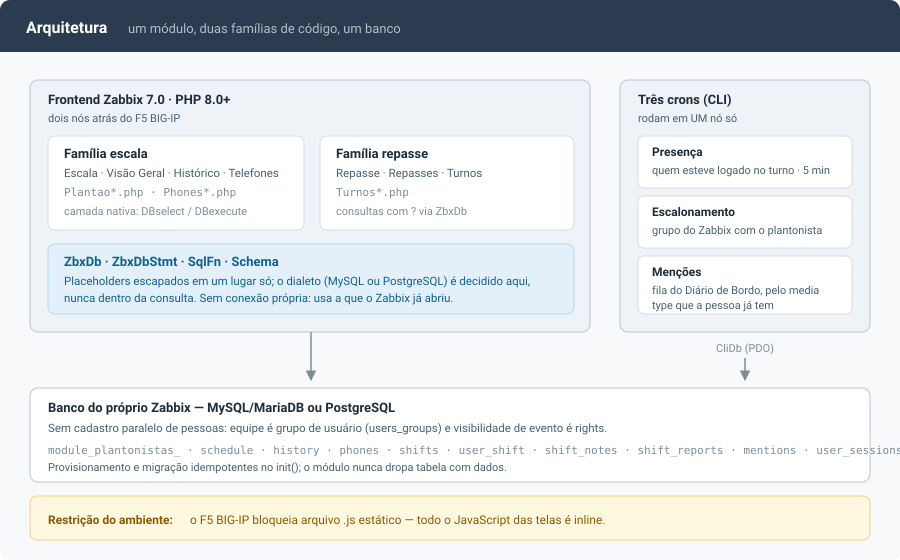
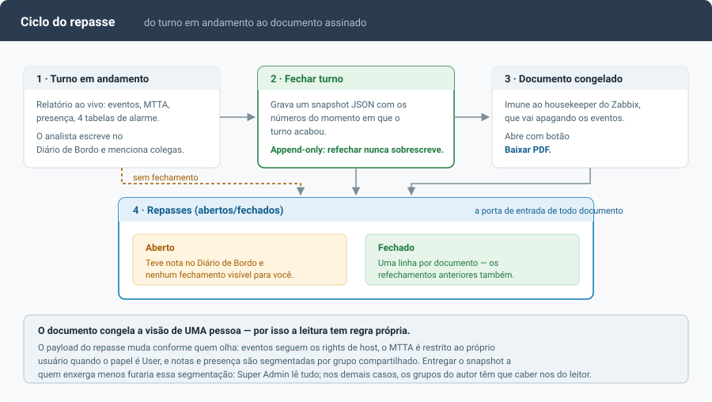

# module-zbx-plantonistas

**Escala de plantão, repasse de turno e escalonamento para o Zabbix 7.0 LTS —
em um módulo só, sem cadastro paralelo de pessoas.**

[](CHANGELOG.md)
[](https://www.zabbix.com/documentation/7.0/)
[](https://www.php.net/)
[](#banco-de-dados-mysqlmariadb-e-postgresql)
[](#como-funciona)

Quem está de plantão hoje, o que aconteceu no turno e para quem o alerta deve
ir às 3h da manhã — as três perguntas no mesmo lugar, usando os grupos de
usuário e os `rights` que o Zabbix já tem. Unifica os antigos
`module-zbx-escala-plantao` (v3.0.1) e `module-zbx-repasse-plantao` (v2.5.0)
em um módulo, um menu e um repositório.

<p align="center">
  
</p>

**Autor:** Rafael M. A. Leão Ereno (MALE) ·
**Forks de origem:** [pandradee/zabbix-escala-de-plantao](https://github.com/pandradee/zabbix-escala-de-plantao) e [JohnnyIver/zabbix-report-module](https://github.com/JohnnyIver/zabbix-report-module)

**Requisitos:** Zabbix 7.0 LTS · PHP 8.0+ nos frontends · MySQL 5.7+/8.0,
MariaDB 10.x **ou** PostgreSQL.

> **Sobre os exemplos deste README:** todo host, IP, domínio, usuário, senha e
> token aparece como *placeholder* (`<host-do-banco>`, `<senha>`, `<token>`).
> Substitua pelos valores do seu ambiente — e nunca versione o arquivo de cron
> preenchido, ele carrega credencial.

---

## Índice

**Começando**
[Instalação](#instalação) ·
[Telas](#telas) ·
[Como funciona](#como-funciona) ·
[Ciclo do repasse](#ciclo-do-repasse) ·
[Funcionalidades](#funcionalidades)

**Operação**
[Banco de dados](#banco-de-dados-mysqlmariadb-e-postgresql) ·
[Migração em produção](#migração-em-produção-frontends-atrás-de-balanceador) ·
[Escalonamento](#escalonamento-mandar-o-alerta-para-quem-está-de-plantão) ·
[Notificar menção](#notificar-menção-do-diário-de-bordo-opcional) ·
[Notas de operação](#notas-de-operação) ·
[Rollback](#rollback)

**Referência**
[De-para da v4](#de-para-completo-a-v4-renomeou-tudo) ·
[Testes](#testes-automatizados) ·
[Segurança](#segurança-e-dados-sensíveis) ·
[Changelog](CHANGELOG.md) ·
[Checklist de lab](CHECKLIST-LAB.md)

---

## Instalação

Pré-requisito: Zabbix 7.0 LTS com backend **MySQL 5.7+/8.0, MariaDB 10.x ou
PostgreSQL**, e PHP 8.0+ no frontend. PostgreSQL segue com homologação
pendente — ver a nota em [Banco de dados](#banco-de-dados-mysqlmariadb-e-postgresql)
antes de usar em produção.

```bash
cd /usr/share/zabbix/modules
git clone https://github.com/leaoereno/module-zbx-plantonistas.git
chown -R apache:apache module-zbx-plantonistas   # Ubuntu/Debian: www-data
systemctl restart php-fpm
```

Depois: **Administration → General → Modules → Scan directory** e habilitar
*Plantonistas*. O menu **Plantão** aparece logo após *Reports*.

Não precisa rodar SQL: o módulo cria e migra as tabelas sozinho no primeiro
carregamento de página, de forma idempotente, e **nunca dropa tabela com
dados**. Se preferir provisionar à mão:

```bash
# MySQL / MariaDB
mysql -h<host-do-banco> -u<usuario-do-banco> -p zabbix \
  < module-zbx-plantonistas/sql/schema.mysql.sql

# PostgreSQL
psql -h <host-do-banco> -U <usuario-do-banco> -d zabbix \
  -f module-zbx-plantonistas/sql/schema.pgsql.sql
```

O `scripts/install.sh` interativo também funciona (Docker, all-in-one ou
segmentado): detecta MySQL/PostgreSQL sozinho (ou pergunta, se não conseguir
ler `zabbix.conf.php`), detecta se o host tem `/etc/cron.d` — caindo para
`crontab` do usuário ou timer systemd quando não tem, caso do Amazon Linux
2023 — e pergunta se o banco é novo antes de rodar o schema.

Dois recursos são **opcionais e exigem configuração**, cada um com sua seção
abaixo: [escalonamento pela escala](#escalonamento-mandar-o-alerta-para-quem-está-de-plantão)
e [notificação de menção](#notificar-menção-do-diário-de-bordo-opcional).

### Já usa uma versão anterior?

Ambiente com os módulos antigos (`plantao` / `turnos-noc-report`) tem um
caminho próprio, com backup e ordem de desligamento:
[Migração em produção](#migração-em-produção-frontends-atrás-de-balanceador).

Vindo da 4.x:

1. `git pull` + `chown -R apache:apache .` + `systemctl restart php-fpm`
   **em todos os frontends**.
2. Abrir qualquer tela uma vez — o `Module::init()` faz as migrações de schema
   (entre elas, `report_json` para `LONGTEXT`, se o schema antigo deixou
   `TEXT`).
3. Conferir as 7 telas, exercitando salvar/remover/importar/escrever nota: o
   CSRF e a troca da camada de banco tocaram todas elas.
4. Nos arquivos de cron, acrescentar `DB_TYPE` (`mysql` ou `pgsql`).
5. Opcional: configurar o
   [cron de escalonamento](#escalonamento-mandar-o-alerta-para-quem-está-de-plantão)
   e a [notificação de menção](#notificar-menção-do-diário-de-bordo-opcional).

O que mudou em cada versão está no [CHANGELOG.md](CHANGELOG.md).

---

## Telas

Sete telas no menu **Plantão**, todas seguindo o tema ativo do Zabbix (claro,
escuro ou customizado — a paleta é detectada pela luminância do fundo já
renderizado, não pelo nome do arquivo de tema).

| Item de menu | Action | Perfil | O que resolve |
|---|---|---|---|
| **Visão Geral** | `plantonistas.overview` | User | Quem está de plantão agora, por grupo e por turno, com telefone no hover. Distingue cobertura total, parcial e ausente |
| **Escala** | `plantonistas.list` | Admin | Calendário mensal. Grupo com turnos cadastrados escala um titular por turno; grupo sem turnos, titular e reserva. Import/export CSV e XLSX |
| **Histórico** | `plantonistas.history` | Admin | Quem mudou a escala, o quê e quando — com o nome do turno congelado na época da alteração |
| **Telefones** | `plantonistas.phones.list` | Admin | Contato por usuário, com máscara brasileira. Importação em massa pelo mesmo CSV que a exportação gera |
| **Repasse Plantão** | `plantonistas.report.view` | User | O relatório do turno: eventos, MTTA, presença, quatro tabelas de alarme, Diário de Bordo com menções e o botão de fechar turno |
| **Repasses (abertos/fechados)** | `plantonistas.report.list` | User | Todo repasse do período: um item por documento fechado (inclusive os refeitos) e um por turno que ainda falta fechar |
| **Gerenciar Turnos** | `plantonistas.shifts.view` | Admin | Turnos por equipe e vínculo analista→turno, individual ou em massa |

**User (1)** enxerga Visão Geral, Repasse e a lista de Repasses; as demais são
**Admin (2)+**. Guest não vê o menu. A restrição vale na action, não só no
menu — esconder o item não adianta, a URL continua lá.

A segmentação por equipe é a do próprio Zabbix: grupos de usuário
(`users_groups`) para escala, notas e presença; `rights` para visibilidade de
evento no Repasse. Sem `rights` configurada por host, todo mundo vê tudo — que
é o comportamento nativo.

---

## Como funciona

<p align="center">
  
</p>

O módulo é frontend puro: nenhum agente, nenhum serviço, nenhum banco próprio.
As nove tabelas `module_plantonistas_*` moram no banco do Zabbix e são criadas
pelo `Module::init()`.

Por dentro convivem **duas famílias de código** de propósito — a que veio da
Escala e a que veio do Repasse. Elas têm estilos diferentes de view e de
consulta, e unificá-las seria um refactor sem ganho para quem usa. O que foi
unificado é o que importa: a paleta (tema do Zabbix), a camada de banco
(`ZbxDb`), o dialeto (`SqlFn`) e o DDL (`Schema.php`, fonte única que gera
`sql/schema.mysql.sql` e `sql/schema.pgsql.sql`).

Os **três crons** são opcionais e independentes: presença de analistas,
escalonamento pela escala e fila de notificação de menções. Cada um roda em
**um nó só** — todos escrevem no banco compartilhado.

---

## Ciclo do repasse

<p align="center">
  
</p>

O relatório do Repasse é **sempre ao vivo** — e é justamente por isso que ele
muda com o tempo: o housekeeper do Zabbix vai apagando os eventos do período,
e o repasse de um turno de dois meses atrás não mostra mais os mesmos números
que mostrava no dia.

**Fechar turno** resolve isso gravando um snapshot com os números do momento
em que o turno acabou. É append-only: refechar cria outro documento e mantém o
anterior, então o histórico é imutável por construção.

A tela **Repasses (abertos/fechados)** é a porta de entrada desses documentos
— inclusive dos refechamentos, que o banner do Repasse não alcança porque só
mostra o último. Ela lista também o que ainda **não** foi fechado: turno com
movimento no Diário de Bordo e sem documento.

---

## Funcionalidades
### Escala

- **Calendário mensal por equipe**, usando os grupos de usuário do Zabbix
  (`users_groups`) como recorte — sem cadastro paralelo de pessoas.
- **Dois modos de escala por grupo:** por turno (quando a equipe tem turnos
  cadastrados em *Gerenciar Turnos*) ou titular/reserva único.
- **Import/export CSV e XLSX**, com reconhecimento de turnos.
- **Histórico de alterações** — quem mudou o quê, e quando.
- **Visão Geral** — quem está de plantão agora, por grupo e por turno.

### Turnos

- Turnos configuráveis **por equipe** (nome, horário de início e fim).
- **Vínculo analista→turno**, individual ou **em massa**.
- Turno que cruza a meia-noite é tratado corretamente na virada do dia.

### Telefones

- Telefone de contato por usuário, com **máscara brasileira**.
- **Importação em massa** (CSV/XLSX) e export CSV.
- Gravação por *upsert* — dois salvamentos simultâneos não duplicam linha.

### Repasse de Plantão (NOC)

- Relatório do turno: **eventos, MTTA, presença de analistas** e gráficos.
- **Diário de Bordo** com editor rico e **menções** `@usuário`, `_hhost` e
  `_hggrupo de hosts`.
- **Menção notifica pelo media type** que a pessoa já tem no Zabbix (e-mail,
  Telegram, webhook), além do banner na tela — opcional, por cron.
- **Fechar turno** — o repasse vira documento imutável, com os números do
  momento em que o turno acabou (imune ao housekeeper).
- **Lista de repasses** (abertos e fechados), com o histórico completo de
  fechamentos — inclusive os refeitos, que o banner da tela não alcança.
- **Export em PDF.**
- **Rastreador de presença** por cron, sem depender da API do Zabbix.

### Escalonamento

- **`cron_sync_oncall.php`** mantém um grupo de usuários do Zabbix por equipe
  com **só o plantonista do turno corrente**. A Ação nativa do Zabbix escala
  para esse grupo — o módulo não reimplementa notificação.

### Plataforma

- **Roda em MySQL/MariaDB e PostgreSQL** com o mesmo código, detectando o
  backend em tempo de execução.
- **Permissões por perfil**, validadas na action e não só no menu.
- **CSRF exigido** em todas as actions de escrita.
- **Provisionamento e migração de schema idempotentes** dentro do `init()` —
  o módulo nunca dropa tabela com dados.
- **Rollback documentado** para os módulos antigos, sem perda de dados.

---

---

## Banco de dados: MySQL/MariaDB **e** PostgreSQL
A partir da 5.0.0 o mesmo código roda nos dois backends. O tipo de banco é
detectado em tempo de execução (`$DB['TYPE']`, que o Zabbix já expõe em
`zabbix.conf.php`); nos crons, pela env `DB_TYPE`.

| Parte | MySQL / MariaDB | PostgreSQL |
|---|---|---|
| Criação e migração das tabelas (`Module::init()`) | ✅ | ✅ `Schema.php` gera o DDL por dialeto; `RENAME`, `ADD COLUMN`, `MODIFY`, índices e introspecção têm ramo próprio |
| Consultas das 7 telas | ✅ | ✅ `SqlFn` gera `to_char`/`to_timestamp`/`EXTRACT`/`ON CONFLICT`; `insert_id` usa `lastval()` |
| Armadilhas semânticas | ✅ | ✅ chaves do `INFORMATION_SCHEMA` em minúsculo, booleano `t`/`f`, comparação de texto com caixa, `SELECT DISTINCT` + `ORDER BY` |
| Crons (`cron_presence_tracker`, `cron_sync_oncall`, `cron_notify_mentions`) | ✅ | ✅ PDO via `scripts/CliDb.php`, dialeto pela env `DB_TYPE` |
| Homologação | ✅ **em produção** | ⚠️ **pendente** — o código está portado, mas ainda não foi executado contra um PostgreSQL de verdade |

> ⚠️ **PostgreSQL: homologação pendente.** O suporte está implementado e é
> exercitado pelo mesmo caminho de código do MySQL, mas nenhum lab PostgreSQL
> validou as 7 telas e os crons até agora. Suba primeiro em ambiente de teste.

Nos crons, acrescente `DB_TYPE=pgsql` ao arquivo (o default é `mysql`, e a
porta acompanha: 3306 ou 5432).

Os artefatos SQL são gerados por dialeto:
`sql/schema.mysql.sql` / `sql/schema.pgsql.sql`,
`sql/rollback-to-old-modules.<banco>.sql`, `sql/queries.<banco>.sql`.

---

---

## Migração em produção (frontends atrás de balanceador)
Faça na janela de menor movimento. Passo a passo:

**0. Backup** — dumpa só as tabelas que existirem (nem todas existem em todo
ambiente: se o schema v2.5 do repasse nunca rodou, `custom_shifts` e
`custom_user_shift` não estão lá — o módulo novo cria as que faltarem).
Troque `<host-do-banco>` e `<usuario-do-banco>`; a senha é pedida
interativamente, **não passe por linha de comando**:

```bash
# MySQL / MariaDB
TABS=$(mysql -h<host-do-banco> -u<usuario-do-banco> -p -N zabbix -e "SELECT GROUP_CONCAT(TABLE_NAME SEPARATOR ' ') FROM INFORMATION_SCHEMA.TABLES WHERE TABLE_SCHEMA='zabbix' AND TABLE_NAME IN ('module_plantao_phones','module_plantao_schedule','module_plantao_history','custom_shifts','custom_user_shift','custom_shift_notes','custom_user_sessions','custom_shift_reports')") && \
mysqldump -h<host-do-banco> -u<usuario-do-banco> -p --single-transaction --no-tablespaces --set-gtid-purged=OFF zabbix $TABS \
  > backup-pre-plantonistas-$(date +%Y%m%d-%H%M).sql
```

```bash
# PostgreSQL — a senha vai por ~/.pgpass (chmod 600), não pela linha de comando
pg_dump -h <host-do-banco> -U <usuario-do-banco> -d zabbix \
  $(for t in module_plantao_phones module_plantao_schedule module_plantao_history \
             custom_shifts custom_user_shift custom_shift_notes \
             custom_user_sessions custom_shift_reports; do echo -n "-t $t "; done) \
  > backup-pre-plantonistas-$(date +%Y%m%d-%H%M).sql
```

`--no-tablespaces` evita o erro de privilégio PROCESS; `--single-transaction`
garante dump consistente sem travar as tabelas.

**1. Deploy do módulo novo — em TODOS os frontends:**

```bash
cd /usr/share/zabbix/modules
git clone https://github.com/leaoereno/module-zbx-plantonistas.git
chown -R apache:apache module-zbx-plantonistas   # Ubuntu/Debian: www-data
systemctl restart php-fpm
```

Não remova os módulos antigos ainda — eles são o rollback instantâneo.

**2. Troca no Zabbix UI** (Administration → General → Modules):

1. **Scan directory** — "Plantonistas" aparece desabilitado.
2. **Desabilite** "Escala de Plantão" e "Relatório Repasse de Plantão"
   (obrigatório antes de habilitar o novo — os três não podem coexistir
   habilitados: o menu Plantão duplicaria).
3. **Habilite** "Plantonistas". Na primeira carga de página o módulo
   renomeia as 8 tabelas antigas sozinho (idempotente; se algo falhar,
   sai no log do PHP-FPM com prefixo `[plantonistas]`).

**3. Roles** (Administration → User roles): para cada role que usava os
módulos antigos, confira na seção Modules se "Plantonistas" está permitido.
Roles com "Default access to new modules" desmarcado precisam de liberação
manual.

> ⚠️ Se salvar o papel falhar com **"Não é possível atualizar a função do
> usuário"** e `Duplicate entry '<N>' for key 'role_rule.PRIMARY'`, o
> problema não é o módulo: é a tabela `ids` do Zabbix atrasada em relação ao
> `MAX(role_ruleid)` (acontece quando alguém insere `role_rule` por SQL
> direto sem atualizar `ids`). Correção no banco:
>
> ```sql
> SELECT MAX(role_ruleid) FROM role_rule;
> SELECT * FROM ids WHERE table_name = 'role_rule';
>
> UPDATE ids SET nextid = (SELECT MAX(role_ruleid) FROM role_rule)
>  WHERE table_name = 'role_rule' AND field_name = 'role_ruleid';
> ```

**4. Crontab do rastreador de presença** — o caminho mudou. Onde estiver o
cron antigo, o jeito mais seguro é derivar do arquivo existente, **sem
redigitar credencial**:

```bash
sed 's|module-zbx-repasse-plantao|module-zbx-plantonistas|g' \
  /etc/cron.d/<arquivo-antigo> > /etc/cron.d/plantonistas-presence
chmod 600 /etc/cron.d/plantonistas-presence
```

Atenção a três coisas que já causaram tabela de presença vazia em produção:

- **Nome do arquivo em `/etc/cron.d/` não pode ter ponto** — o cron ignora
  `algo.disabled` silenciosamente (é assim que se desativa).
- **As variáveis `DB_TYPE`/`DB_HOST`/`DB_PORT`/`DB_NAME`/`DB_USER`/`DB_PASS`
  são obrigatórias no arquivo de cron**: em CLI não existe `$GLOBALS['DB']`, e
  sem elas o script tenta `localhost`. São as **únicas** env necessárias —
  desde a 5.0 o script lê tudo do banco e não chama mais a API do Zabbix,
  então `ZABBIX_API_TOKEN` e `ZABBIX_URL` podem sair do arquivo (e o token ser
  revogado no Zabbix).
- **Rodar em UM frontend só** — grava no banco compartilhado; em dois,
  duplica escrita sem ganho nenhum.

O script **não cria tabela**: se `module_plantonistas_user_sessions` não
existir, ele encerra pedindo que o módulo seja habilitado uma vez no frontend
(é o `Module::init()` que provisiona e migra o schema).

Teste manual antes de esperar o cron (as aspas simples do arquivo protegem o
`$` da senha):

```bash
set -a; source <(grep -E "^DB_" /etc/cron.d/plantonistas-presence); set +a
php /usr/share/zabbix/modules/module-zbx-plantonistas/scripts/cron_presence_tracker.php
```

**5. Validação** — abrir cada tela uma vez (Visão Geral, Escala, Histórico,
Telefones, Repasse Plantão, Gerenciar Turnos), com `catch_workers_output = yes`
no pool e `tail -f` no log do PHP-FPM. Conferir se a escala do mês e as notas
do diário de bordo estão lá (estarão — as tabelas são as mesmas, só de nome
novo).

**6. Limpeza** (alguns dias depois, com tudo estável) — em todos os frontends:

```bash
rm -rf /usr/share/zabbix/modules/module-zbx-escala-plantao
rm -rf /usr/share/zabbix/modules/module-zbx-repasse-plantao
```

Depois Scan directory de novo (os dois somem da lista).

### Limpeza opcional de `role_rule` órfãs

**Na maioria das instalações não há nada para limpar** — e é importante saber
por quê, senão o SELECT volta vazio e fica a dúvida se rodou certo.

Permissão de módulo no Zabbix 7.0 **não** guarda nome de action. O
`CRole::RULE_TYPE_MODULE` grava a regra como `name = 'modules.module.N'` com o
módulo referenciado por **`value_moduleid`**, FK para `module.moduleid`. Ou
seja: quem liberou os módulos antigos pela UI não gerou linha nenhuma com nome
de action, e ao remover o módulo do `module` (Scan directory depois do
`rm -rf`) a FK tende a levar a regra junto.

O campo `value_str` é usado por `api.method.N` e por tag de serviço. Nome de
action aparece ali só quando **alguém inseriu a regra à mão por SQL**. Se foi
assim neste ambiente, a consulta (a) devolve algo; se não foi, volta vazia e
está tudo certo.

**Confira ANTES de apagar**, pelos dois caminhos:

```sql
-- (a) regras inseridas à mão por SQL — nome de action em value_str
SELECT rr.role_ruleid, r.name AS papel, rr.type, rr.name, rr.value_str
  FROM role_rule rr
  JOIN role r ON r.roleid = rr.roleid
 WHERE rr.value_str LIKE 'plantao.%'
    OR rr.value_str LIKE 'phones.%'
    OR rr.value_str LIKE 'turnos.%'
 ORDER BY r.name, rr.value_str;

-- (b) o caminho OFICIAL: regra de módulo apontando por value_moduleid.
--     Linha com m.moduleid NULL = o módulo já saiu da tabela `module`.
SELECT rr.role_ruleid, r.name AS papel, rr.name, m.relative_path
  FROM role_rule rr
  JOIN role r        ON r.roleid   = rr.roleid
  LEFT JOIN module m ON m.moduleid = rr.value_moduleid
 WHERE rr.value_moduleid IS NOT NULL
   AND (m.moduleid IS NULL
        OR m.relative_path LIKE '%escala-plantao%'
        OR m.relative_path LIKE '%repasse-plantao%')
 ORDER BY r.name;
```

O `LIKE` de (a) é amplo de propósito: num Zabbix com outros módulos ele pode
casar regra que não é sua — `turnos.%` e `phones.%` não têm dono garantido.
Por isso o DELETE vai **pelos IDs que você acabou de ver**, nunca repetindo o
`LIKE`:

```sql
DELETE FROM role_rule WHERE role_ruleid IN (/* os ids dos SELECTs */);
```

Apagar não mexe na tabela `ids` — o contador só anda para frente, e ficar à
frente do `MAX` é normal. Não confundir com o problema **oposto**, o de `ids`
atrasada, que impede salvar papel (ver o aviso acima).

---

---

## Escalonamento: mandar o alerta para quem está de plantão
`scripts/cron_sync_oncall.php` mantém, para cada equipe, um grupo de usuários
do Zabbix contendo **só o plantonista do turno corrente**. A Ação nativa do
Zabbix escala para esse grupo — o módulo não reimplementa notificação.

**1. Criar os grupos**, um por equipe, em Usuários → Grupos de utilizadores.
O nome segue a convenção `Plantonista de Hoje - <nome da equipe>`:

| Equipe (grupo que aparece na Escala) | Grupo a criar |
|---|---|
| `NOC` | `Plantonista de Hoje - NOC` |
| `Redes` | `Plantonista de Hoje - Redes` |

Criar **vazio, com Status = Habilitado** e sem permissões de host. O cron
cuida dos membros. O prefixo pode ser trocado pela env `ONCALL_GROUP_PREFIX`
(o `" - "` é acrescentado se você não puser um separador).

⚠️ **O grupo precisa estar Habilitado.** O status de um usuário no Zabbix é
`MAX(users_status)` sobre todos os grupos dele: se este grupo estiver como
Desabilitado, incluir o plantonista nele **desabilita a conta dele** — ele
para de logar, some das telas do próprio módulo e deixa de ser notificado, que
é o oposto do que se quer. O script recusa o grupo nesse caso, com aviso no
log.

**O script nunca cria grupo** — criar exige reservar `usrgrpid` na tabela `ids`
do Zabbix, e escrever ID na mão em tabela do core já custou caro aqui (ver a
seção da tabela `ids` no `CLAUDE.md`).

**2. Agendar**, no mesmo frontend do rastreador de presença:

```bash
cat > /etc/cron.d/plantonistas-oncall <<'EOF'
DB_TYPE=<mysql|pgsql>
DB_HOST=<host-do-banco>
DB_NAME=zabbix
DB_USER=<usuario-do-banco>
DB_PASS=<senha>
*/5 * * * * apache php /usr/share/zabbix/modules/module-zbx-plantonistas/scripts/cron_sync_oncall.php >> /var/log/plantonistas-oncall.log 2>&1
EOF
chmod 600 /etc/cron.d/plantonistas-oncall
```

`chmod 600` porque o arquivo tem senha. **Um frontend só**: em dois, duas
execuções simultâneas disputam a mesma reserva de ID.

**3. Conferir antes de valer**, sem gravar nada:

```bash
set -a; source <(grep -E "^DB_" /etc/cron.d/plantonistas-oncall); set +a
DRY_RUN=1 php /usr/share/zabbix/modules/module-zbx-plantonistas/scripts/cron_sync_oncall.php
```

**4. Apontar a Ação** (Alertas → Ações) para o grupo `Plantonista de Hoje - …`
em vez da lista fixa de destinatários.

Comportamentos que valem saber:

- **Dia ou turno sem ninguém escalado não esvazia o grupo** — quem estava
  continua até alguém ser escalado. Esvaziar significaria alerta sem
  destinatário justamente de madrugada. Sai um `INFO:` no log toda vez.
- **Só o titular entra.** O reserva (que só existe em grupo sem turnos) fica
  de fora: reserva não está de plantão, está disponível.
- A virada de turno leva até 5 minutos para refletir no grupo, mais o config
  sync do Zabbix server (~1 min). E um escalonamento já em andamento
  re-resolve o grupo a cada passo, então o destinatário pode trocar no meio de
  uma escalada — é comportamento nativo do Zabbix, não do módulo.
- O script sai com código **1** se alguma equipe falhou (grupo inexistente,
  plantonista removido do Zabbix, turnos ilegíveis). Dá para monitorar o cron
  por isso; o log traz `WARN:` com o motivo em cada caso.

---

---

## Notificar menção do Diário de Bordo (opcional)
Quando alguém é mencionado com `@` numa nota, o módulo pode avisar pelo media
type que a pessoa já tem no Zabbix (e-mail, Telegram, webhook), além do banner
na tela. **É opcional**: sem a configuração abaixo nada muda e nada quebra —
o banner continua funcionando.

O aviso sai por um **cron** (`scripts/cron_notify_mentions.php`), não durante o
save da nota: a menção é gravada na hora e o envio acontece no próximo ciclo,
sem ninguém esperando a tela responder.

A via usada é o request `alert.send` do Zabbix server, a mesma do botão "Test"
em Alertas → Tipos de mídia. Ela **exige Super Admin**, então precisa de um
token de API.

**1. Gerar o token** — Usuários → Tokens de API → Criar, com um usuário Super
Admin. Guarde o valor: ele só aparece uma vez. Trate-o como senha — arquivo
`chmod 600`, nunca no repositório.

**2. Abrir o módulo uma vez no navegador antes de agendar.** A coluna
`notified_at` (a fila) é criada pela migração que roda no `Module::init()`, ou
seja, no primeiro carregamento de página com o módulo habilitado. Agendado
antes disso, o cron falha a cada minuto com `CRITICAL: Falha ao ler a fila`.

**3. Agendar o cron**, no mesmo frontend dos outros dois:

```bash
cat > /etc/cron.d/plantonistas-mentions <<'EOF'
DB_TYPE=<mysql|pgsql>
DB_HOST=<host-do-banco>
DB_NAME=zabbix
DB_USER=<usuario-do-banco>
DB_PASS=<senha>
PLANTONISTAS_ALERT_TOKEN=<token de API de 64 caracteres>
ZBX_SERVER=<host-do-zabbix-server>
ZBX_SERVER_PORT=10051
ZBX_FRONTEND_URL=https://<seu-frontend-zabbix>/zabbix
* * * * * apache php /usr/share/zabbix/modules/module-zbx-plantonistas/scripts/cron_notify_mentions.php >> /var/log/plantonistas-mentions.log 2>&1
EOF
chmod 600 /etc/cron.d/plantonistas-mentions
```

`chmod 600` porque o arquivo tem a senha do banco **e** o token de Super Admin.
**Um frontend só**: o script marca as menções como notificadas no banco
compartilhado, e em dois nós a mesma menção sairia duas vezes.

**4. Conferir antes de valer**, sem enviar nem marcar nada:

```bash
set -a; source <(grep -E "^(DB_|ZBX_|PLANTONISTAS_)" /etc/cron.d/plantonistas-mentions); set +a
DRY_RUN=1 php /usr/share/zabbix/modules/module-zbx-plantonistas/scripts/cron_notify_mentions.php
```

O que o módulo faz por conta própria, porque o `alert.send` não faz:

- **Respeita a janela** de notificação configurada no cadastro do usuário
  (mídia habilitada + período), avaliada no fuso horário **do destinatário**.
  A severidade da mídia é ignorada — menção não tem severidade.
- **Não repete**: dez menções à mesma pessoa viram um aviso dizendo "10
  menções", não dez e-mails.
- **Não avisa quem está online.** Se a pessoa está com o Zabbix aberto, ela vê
  o banner do Repasse; mandar e-mail seria redundante. Usa a tabela de
  presença, populada pelo cron de presença.
- **Não avisa de menção velha.** Se o cron ficar parado, menção com mais de
  24 h sai da fila sem aviso — receber o acúmulo de uma semana não ajuda
  ninguém.

Limites conhecidos: media type do tipo "Script" não é suportado (o `alert.send`
espera os parâmetros dele em outro formato). Sem `ZBX_FRONTEND_URL` o corpo da
mensagem vai sem link — de propósito: montar a URL a partir do cabeçalho `Host`
da requisição deixaria quem escreve a nota apontar o link para um domínio
próprio, e o colega receberia esse link pelo canal legítimo do Zabbix.

---

---

## Notas de operação
- **Balanceador L7 que bloqueia `.js` estático** (F5 BIG-IP, por exemplo).
  Todo o JS das telas é inline nas views. Sobram dois arquivos em
  `assets/js/`: o **Chart.js**, que os dois gráficos do Repasse usam de
  verdade, e um **stub** exigido pelo `manifest.json` (o Zabbix pede o
  arquivo; o conteúdo não faz nada — se o balanceador bloquear esse, não
  acontece nada).

  O Chart.js continua sendo carregado por `<script src>`, que o navegador
  cacheia entre páginas — embutir 204 KB em toda carga do Repasse seria pior no
  caso normal, que é o balanceador deixando passar. **Se os gráficos não
  aparecerem**, a tela agora diz isso em vez de ficar em branco, e a correção
  não exige mexer em código: ligue a env no pool do PHP-FPM
  (`/etc/php-fpm.d/zabbix.conf`) e reinicie —

  ```ini
  env[PLANTONISTAS_CHART_INLINE] = 1
  ```

  A biblioteca passa a ser embutida na página, e o único `.js` que o
  balanceador ainda vê é o stub inofensivo. Se a env estiver ligada e o arquivo
  não for legível pelo PHP (típico de `git pull` como root sem o `chown`
  depois), sai `[plantonistas]` no log do FPM em vez de falhar calado.
- **Sempre atualize e reinicie o php-fpm em TODOS os frontends** — o
  balanceador serve código velho de nó não atualizado de forma intermitente.
- `git pull` como root deixa arquivos com dono root: rode
  `chown -R apache:apache .` depois.
- Erro 500 sem rastro: habilite `catch_workers_output = yes` no pool
  (`/etc/php-fpm.d/zabbix.conf`) e acompanhe o log do FPM.
- O módulo não tem `onInstall`/`onUninstall` (o Zabbix nunca chama esses
  hooks); todo o provisionamento/migração é idempotente dentro do `init()`, e
  o módulo nunca dropa tabela com dados.
- **O Diário de Bordo não expira** — é histórico permanente, por decisão. As
  únicas limpezas automáticas do módulo são as sessões de presença (7 dias) e
  os vínculos analista→turno quando o turno é removido. Se um dia a tabela
  incomodar, a consulta de tamanho está em `sql/queries.<banco>.sql`
  ("Crescimento do Diário de Bordo"); arquivar é decisão de quem opera, não
  algo que o módulo faça sozinho.

---

---

## Rollback
Enquanto as pastas antigas existirem nos frontends, o rollback é rápido:

1. Zabbix UI: desabilitar "Plantonistas" (primeiro! senão o `init()` dele
   desfaz o passo 2 na próxima carga de página).
2. Rodar `sql/rollback-to-old-modules.<banco>.sql` (renames reversos,
   instantâneo; dados gravados durante a vigência da v4/v5 são mantidos).
3. Zabbix UI: reabilitar os dois módulos antigos.
4. Restaurar a linha antiga do crontab.

---

---

## De-para completo (a v4 renomeou tudo)
**Actions / URLs** — links salvos com os nomes antigos param de funcionar:

| Antiga | Nova |
|---|---|
| `plantao.overview` | `plantonistas.overview` |
| `plantao.list` | `plantonistas.list` |
| `plantao.save` / `plantao.delete` | `plantonistas.save` / `plantonistas.delete` |
| `plantao.history` | `plantonistas.history` |
| `plantao.export` / `plantao.import` | `plantonistas.export` / `plantonistas.import` |
| `phones.list` / `phones.export` / `phones.save` | `plantonistas.phones.list` / `.export` / `.save` |
| `turnos.report.view` | `plantonistas.report.view` |
| `turnos.report.notes.save` / `.get` | `plantonistas.report.notes.save` / `.get` |
| `turnos.report.pdf` | `plantonistas.report.pdf` |
| `turnos.shifts.view` / `.save` / `.delete` | `plantonistas.shifts.view` / `.save` / `.delete` |
| `turnos.usershift.save` | `plantonistas.usershift.save` |

**Tabelas** — renomeadas automaticamente pelo módulo (rename atômico, sem
cópia de dados; dados 100% preservados):

| Antiga | Nova |
|---|---|
| `module_plantao_phones` | `module_plantonistas_phones` |
| `module_plantao_schedule` | `module_plantonistas_schedule` |
| `module_plantao_history` | `module_plantonistas_history` |
| `custom_shifts` | `module_plantonistas_shifts` |
| `custom_user_shift` | `module_plantonistas_user_shift` |
| `custom_shift_notes` | `module_plantonistas_shift_notes` |
| `custom_user_sessions` | `module_plantonistas_user_sessions` |
| `custom_shift_reports` | `module_plantonistas_shift_reports` |

---

---

## Testes automatizados
```bash
php tests/run.php
```

Sem dependência (nada de PHPUnit/Composer — o módulo não tem `vendor/`, e
instalar isso só pra rodar 4 arquivos de teste seria mais atrito que valor).
Sai com código `0` se tudo passou (ou só pulou) e `1` se algo falhou — dá pra
plugar num pipeline de CI ou num hook de pre-commit local.

Cobre só a lógica **pura**, sem o framework do Zabbix carregado:
`UserLabel`/`formatUserLabel()` (dedup de nome duplicado), `PhonesFormat`
(máscara de telefone brasileira), `SqlFn` (dialeto MySQL × PostgreSQL) e
`TurnosReportBase::sanitizeNoteHtml()` (sanitização do Diário de Bordo,
incluindo o bypass aninhado `<iframe><span onclick>` e os esquemas
`javascript:`/`data:`). Os controllers (`Plantao*`, `Turnos*Save` etc.) e as
consultas que dependem de `ZbxDb`/`\DBselect` continuam só verificáveis no
lab — não tem como isso ser unitário sem simular o Zabbix inteiro; ver
`CHECKLIST-LAB.md`.

Requer PHP 8.0+ com a extensão `dom` (para os testes de sanitização — sem
ela, aquela suíte é pulada com aviso, o resto roda normal).

---

---

## Segurança e dados sensíveis
- Nenhum host, IP, domínio, usuário, senha ou token real neste repositório —
  os exemplos usam placeholders.
- Arquivos de cron com credencial: **`chmod 600`** e fora do controle de
  versão.
- O cron de presença **não usa mais token de API**; se o seu ambiente ainda
  tem `ZABBIX_API_TOKEN` no arquivo de cron, remova e **revogue o token** no
  Zabbix.
- Todas as actions de escrita exigem **token CSRF**.
- Consultas usam a camada de banco do Zabbix com bind de parâmetro.
